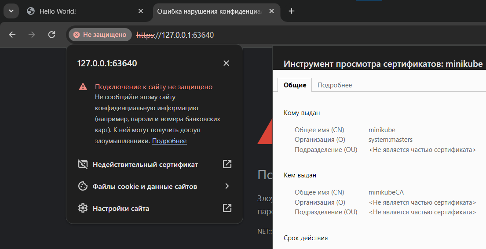

## Цель работы:
Настроить подключение к сервису в миникубе через https, используя самоподписанный сертификат


## Ход работы

Для создания сертификата пропишем следующие команды
  ```
  openssl genpkey -algorithm RSA -out private-key.pem
  ```
openssl genpkey: Команда для генерации ключей.

-algorithm RSA: Указывает алгоритм шифрования, в данном случае RSA.

-out private-key.pem: Определяет имя файла для сохранения сгенерированного закрытого ключа (private key).
  ```
  openssl req -new -key private-key.pem -out server.csr -config certs.conf
  ```
openssl req: Команда для запроса на создание сертификата.

-new: Создает новый запрос на сертификат.

-key private-key.pem: Указывает закрытый ключ, используемый для создания запроса.

-out server.csr: Указывает имя файла, в который будет записан созданный запрос на сертификат (Certificate Signing Request, CSR).

-config certs.conf: Указывает конфигурационный файл с параметрами для запроса.
  ```
  openssl x509 -req -in server.csr -signkey private-key.pem -out server.crt -extensions v3_req -extfile certs.conf
  ```
Эта команда использует созданный запрос на сертификат (CSR) и закрытый ключ для создания самоподписанного SSL-сертификата.

openssl x509: Команда для создания или подписи сертификата.

-req: Указывает, что входной файл - это запрос на сертификат (CSR).

-in server.csr: Указывает имя файла с запросом на сертификат.

-signkey private-key.pem: Указывает закрытый ключ для подписи сертификата.

-out server.crt: Указывает имя файла, в который будет записан созданный самоподписанный сертификат.

-extensions v3_req -extfile certs.conf: Указывает расширения для сертификата, которые определены в конфигурационном файле certs.conf.

Теперь необходимо "включить" ingress в minikube
  ```
minikube addons enable ingress
  ```
Также необходимо прописать секрет в файле ingress.yaml и изменить его командой
  ```
kubectl apply -f ingress.yaml
  ```
Теперь при получении ip и переходе по нему, мы увидим следующую картину


Браузер ругается на самоподписанный сертификат, потому что браузеры доверяют сертификатам, подписанным доверенными Центрами сертификации. А мы сами подписали этот сертификат, поэтому браузер считает его недостоверным. Ну и такой сертификат может создать любой человек, а проверить действительно ли он принадлежит данному веб-серверу не представляется возможным.

## Вывод
В ходе выполнения лабораторной работы было настроено подключение к сервису в minikube через https, с помощью самоподписанного сертификата.

## Выполнили
Студенты группы К34211: Наумов М., Захаров Е. и Коркунов. Ф
