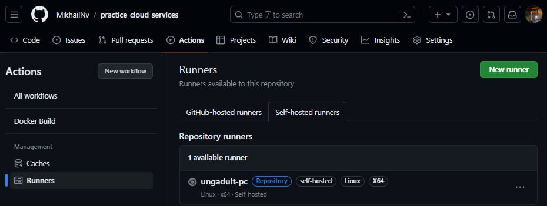
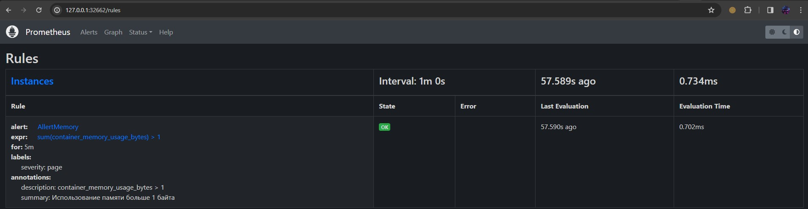
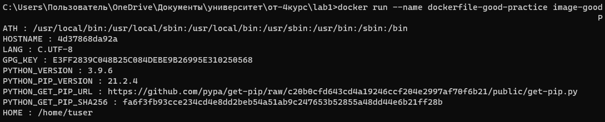

## Цель работы:
Настроить репозиторий так, чтобы после пуша в него автоматически собирался докер образ на нашей машине при этом секреты должны браться с сервера vault и результат его сборки сохранялся на dockerhub

## Задачи:
* Настроить работу CI/CD в текущем репозитории путем добавления в репозиторий файл .github/workflows/docker-build.yaml, который будет собирать новый образ и заливать на dockerhub;
* Запустить vault-сервер и добавить туда секреты ;
* Проверить 2 образа с разными сборками: показать что во 2 случае собрался обновленный проект (после пуша).

## Ход работы

 > Стоит отметить, что данная лабораторная работа является дополнением, к лабораторной работе №3. Здесь добавлен раздел "[Настройка секретов](#настройка-секретов)". Для общего понимания картины остальные шаги оставлены, как в Лабораторной работе №3.

### Создание репозитория с проектом

 В качестве рабочего проекта был загружен дефолтный проект Web-API на ASP.net Core, в котором реализован контроллер WeatherForecast (путь к файлу: ./API/Controllers/WeatherForecastController.cs), в котором реализован метод Get() (get-запрос к серверу). Сейчас он возвращает массив ранломных прогнозов (от 1 до 5):
 ```
   [ApiController]
   [Route("[controller]")]
   public class WeatherForecastController : ControllerBase
   {
       private static readonly string[] Summaries = new[]
       {
       "Freezing", "Bracing", "Chilly", "Cool", "Mild", "Warm", "Balmy", "Hot", "Sweltering", "Scorching"
       };
  
       private readonly ILogger<WeatherForecastController> _logger;
  
       public WeatherForecastController(ILogger<WeatherForecastController> logger)
       {
           _logger = logger;
       }
  
       [HttpGet(Name = "GetWeatherForecast")]
       public IEnumerable<WeatherForecast> Get()
       {
           return Enumerable.Range(1, 5).Select(index => new WeatherForecast
           {
               Date = DateTime.Now.AddDays(index),
               TemperatureC = Random.Shared.Next(-20, 55),
               Summary = Summaries[Random.Shared.Next(Summaries.Length)]
           })
           .ToArray();
       }
   }
  ```
### Подключение своей машины к гиту
Для этого были выполнены пару шагов по инструкции. В результате получилось добавить в раннеры свою машину:



### Запуск и настройка Vault
Для этого он сначала был установлен


Затем был запушен и добалены секреты и токен для аутентификации

```bin/vault kv put -mount=secret docker username=ungadult```

```bin/vault token create -period=30m ```


### Настройка работы CI/CD в текущем репозитории

 Для настройки используется GitHub Actions. Был реалихован файл файл .github/workflows/docker-build.yaml (в комментариях файла есть пояснения):
  ```
 name: Docker Build

 on:
   push:
     branches:
       - lab-3 ## ветка(и), для которой ниже создается job при push'e
     paths:
       - "API/**" ## папка, для которой отслеживаются пуши
 
       
 jobs:
   build:
     runs-on: self-hosted ## указываем, что сборку запускам на нашей машине, которую подклюичли к гиту
 
     defaults:
       run:
         working-directory: "/API" ## базовая директория
 
     steps:
       - name: Checkout Repository ## доступ к репозиторию
         uses: actions/checkout@v2


       - name: import-secrets
         uses: hashicorp/vault-action@v2
         with:
           url: http://127.0.0.1:8200
           tlsSkipVerify: true
           token: ${{ secrets.VAULT_TOKEN }} #в секрктах гитхаба находится токен, который получили после создания токена
           secrets: |
            secret/data//docker * | DOCKERHUB_

      - name: docker-hub-login
        uses: docker/login-action@v3
        with:
          username: ${{ env.DOCKERHUB_username }}
          password: ${{ env.DOCKERHUB_password }}
     
       - name: Docker pushing ##вход в учетную запись dockerhub, куда будет зугружен собранный образ на dockerhub
         uses: docker/build-push-action@v5
         with:
           context: "./API/" ##Путь к папке с проектом для сборки
           push: true
           tags: ungadult/api:latest
  ```

### Тест сборки
Обновим проект, удалив несколько элементов из массива
После этого у нас запустился новый workflow:


По заваршении новый образ загрузился к нам в репозиторий на dockerhub. Запустим новую версию API:


Повторим запрос. Как мы видим, теперь запрос возвращает не массив прогнозов погод, а лишь 1 прогноз погоды. Это говорит о том, что мы загрузили с dockerhub, обновленный образ, в котором загружена новая версия API, что и требовалось



*У Vault есть возможность синхронизации секретов с GitHub Actions:


## Вывод
В ходе выполнения лабораторной работы был настроен CI/CD: после пуша в папку API рабочего репозитория создавается новый docker-образ,при этом секреты берутся из Vault, и сохраняется на dockerhub. Во время выполнения работы проблем не возникло.
## Выполнили
Студенты группы К34211: Наумов М., Захаров Е. и Коркунов. Ф
