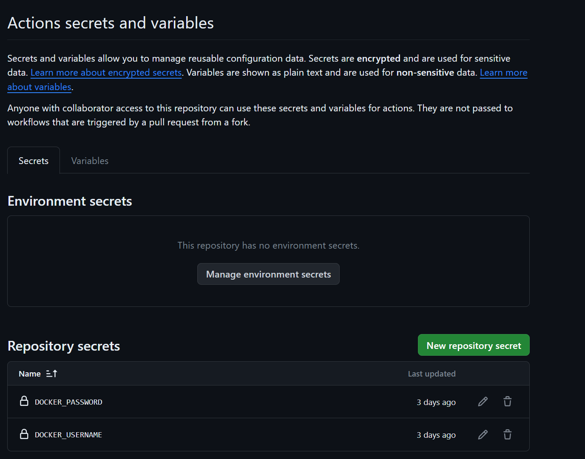
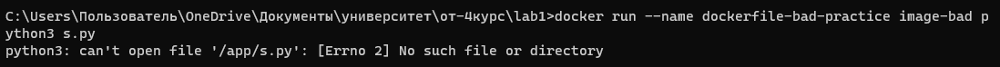
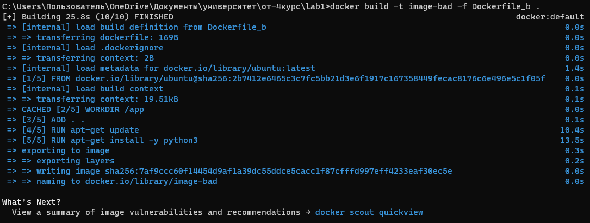
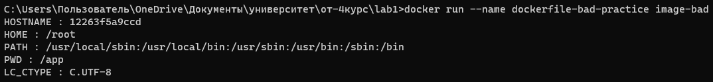
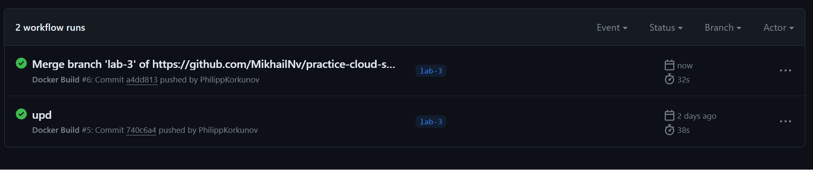
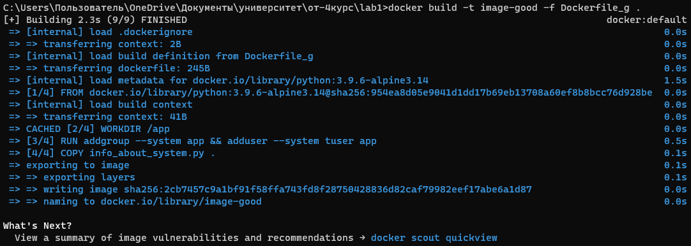

## Цель работы:
Настроить репозиторий так, чтобы после пуша в него автоматически собирался докер образ и результат его сборки сохранялся на dockerhub

## Задачи:
* Настроить работу CI/CD в текущем репозитории путем добавления в репозиторий файл .github/workflows/docker-build.yaml, который будет собирать новый образ и заливать на dockerhub;
* Добавить секреты в настройках репозитория;
* Проверить 2 лбраза с разными сборками: показать что во 2 случае собрался обновленный проект (после пуша).

## Ход работы

 Создание репозитория с проектом

 В качестве рабочего проекта был загружен дефолтный проект Web-API на ASP.net Core, в котором реализован контроллер WeatherForecast (путь к файлу: ./API/Controllers/WeatherForecastController.cs), в котором реализован метод Get() (get-запрос к серверу). Сейчас он возвращает массив ранломных прогнозов (от 1 до 5):
 ```
   [ApiController]
   [Route("[controller]")]
   public class WeatherForecastController : ControllerBase
   {
       private static readonly string[] Summaries = new[]
       {
       "Freezing", "Bracing", "Chilly", "Cool", "Mild", "Warm", "Balmy", "Hot", "Sweltering", "Scorching"
       };
  
       private readonly ILogger<WeatherForecastController> _logger;
  
       public WeatherForecastController(ILogger<WeatherForecastController> logger)
       {
           _logger = logger;
       }
  
       [HttpGet(Name = "GetWeatherForecast")]
       public IEnumerable<WeatherForecast> Get()
       {
           return Enumerable.Range(1, 5).Select(index => new WeatherForecast
           {
               Date = DateTime.Now.AddDays(index),
               TemperatureC = Random.Shared.Next(-20, 55),
               Summary = Summaries[Random.Shared.Next(Summaries.Length)]
           })
           .ToArray();
       }
   }
  ```


 Настроить работу CI/CD в текущем репозитории

 Для настройки используется GitHub Actions. Был реалихован файл файл .github/workflows/docker-build.yaml (в комментариях файла есть пояснения):
  ```
 name: Docker Build

 on:
   push:
     branches:
       - lab-3 ## ветка(и), для которой ниже создается job при push'e
     paths:
       - "API/**" ## папка, для которой отслеживаются пуши
 
       
 jobs:
   build:
     runs-on: ubuntu-latest ## используется ubuntu, так как там предустановлен docker
 
     defaults:
       run:
         working-directory: "/API" ## базовая директория
 
     steps:
       - name: Checkout Repository ## доступ к репозиторию
         uses: actions/checkout@v2
 
       - name: Docker loggin in ##вход в учетную запись dockerhub, куда будет зугружен собранный образ
         uses: docker/login-action@v3
         with:
           username: ${{ secrets.DOCKER_USERNAME }} ##логин от аккаунта 
           password: ${{ secrets.DOCKER_PASSWORD }} ##пароль от аккаунта
     
       - name: Docker pushing ##вход в учетную запись dockerhub, куда будет зугружен собранный образ на dockerhub
         uses: docker/build-push-action@v5
         with:
           context: "./API/" ##Путь к папке с проектом для сборки
           push: true
           tags: ungadult/api:latest
  ```

 Настроить секреты

 В этих строчках мы ссылаемся на секреты DOCKER_USERNAME и DOCKER_PASSWORD, которые мы создали в настроках репозитория

 ```
  username: ${{ secrets.DOCKER_USERNAME }} ##логин от аккаунта 
  password: ${{ secrets.DOCKER_PASSWORD }} ##пароль от аккаунта
  ```


Теперь запустим заново workflow. Получаем



Тест сборки


Получаем собранный образ
  ```
 docker pull philippkorkunov/test
  ```
Запускаем его на 8080 порту командой, который слушает 80 порт запущенного в докере API
 ```
 docker run -p 8080:80 <имя_пользователя_на_dockerhub_из_secrets>/<название_образа>
 ```
В нашем случае тестировали на dockerhub philippkorkunov
 ```
 docker run -p 8080:80 philippkorkunov/test
 ```
Делаем запрос. http://localhost:8080/WeatherForecast. Как видно, нам пришел ответ (в виде json) с массивом прогнозов погоды, то есть проект собрался и развернулся в докере.



Далее смоделируем ситуацию рельной разработки: теперь нам стало необходимо, что возвращался в запросе лишь 1 прогноз погоды.
Внесем изменения в файл ./API/Controllers/WeatherForecastController.cs изменения:
  ```
[ApiController]
[Route("[controller]")]
public class WeatherForecastController : ControllerBase
{
    private static readonly string[] Summaries = new[]
    {
    "Freezing", "Bracing", "Chilly", "Cool", "Mild", "Warm", "Balmy", "Hot", "Sweltering", "Scorching"
    };

    private readonly ILogger<WeatherForecastController> _logger;

    public WeatherForecastController(ILogger<WeatherForecastController> logger)
    {
        _logger = logger;
    }

    [HttpGet(Name = "GetWeatherForecast")]
    public WeatherForecast Get(int index)
    {
        return new WeatherForecast
        {
            Date = DateTime.Now.AddDays(index),
            TemperatureC = Random.Shared.Next(-20, 55),
            Summary = Summaries[Random.Shared.Next(Summaries.Length)]
        };
    }
}
  ```
После этого у нас запустился новый workflow:

По заваршении новый образ загрузился к нам в репозиторий на dockerhub. Запустим новую версию API:

Повторим запрос. Как мы видим, теперь запрос возвращает не массив прогнозов погод, а лишь 1 прогноз погоды. Это говорит о том, что мы загрузили с dockerhub, обновленный образ, в котором загружена новая версия API, что и требовалось



## Вывод
В ходе выполнения лабораторной работы был настроен CI/CD: после пуша в папку API рабочего репозитория создавается новый docker-образ и сохраняется на dockerhub. Во время выполнения работы проблем не возникло.
## Выполнили
Студенты группы К34211: Наумов М., Захаров Е. и Коркунов. Ф
