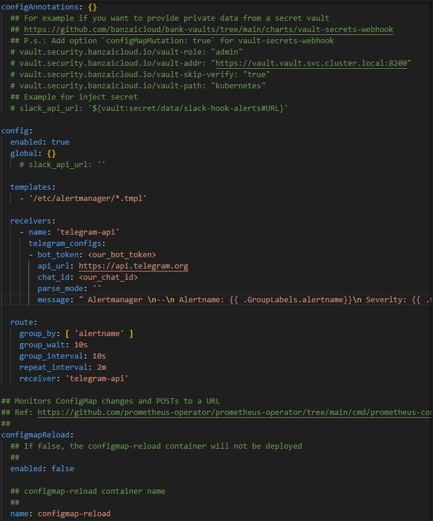

### Отчёт по лабораторной работе №4*
### Мониторинг сервиса в Kubernetes

### Цель работы: 
Настроить алерт кодом оповещения о состоянии сервиса через Alertmanager.

## Ход работы


Первым делом был создан телеграмм-канал и телеграмм-бот, который был добавлен в канал: https://t.me/lab4KorkunovNaumovZakhar 

После этого создали prometheus/values.yml, в котором описали парамтеры нашего алерта:


Затем установили prometheus с указанным конфигом командой 

```
helm install prometheus prometheus-community/prometheus -f .\charts\prometheus\values.yml
```

Далее выполнили подготвку сервиса и его последующий запуск:

```
kubectl expose service prometheus-server --type=NodePort --target-port=9090 --name=prometheus-server-np

minikube service prometheus-server
```

После чего увидели созданную роль:


Далее создали файл alertmanger/values.yml, в который скопировали конфиг алер менеджера и добавили настройки телеграмма



В конце запустили алерт менеджер с указанным конфигом


Зайдем на  http://localhost:9091 :


Уведомление будет приходить в случае, когда используемая память привышает 1 байт

Это видно и в алерт менеджере


В телеграмм-канал тоже пришло сообщение


### Вывод: был изучен и установлен AlertManager, c помощью которого мы смогли отпраить уведомление в телеграмм-канал. Проблем не возникло
