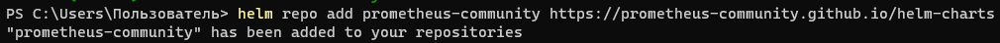
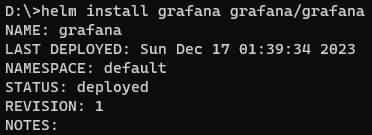
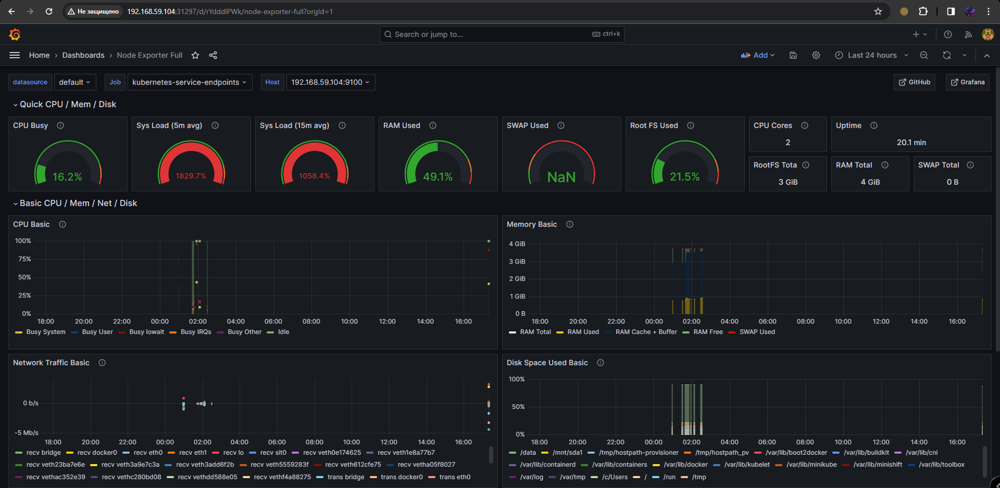

## Цель работы:
Настроить мониторинг Kubernetes при помощи инструментов Prometheus и Grafana.

## Задачи:
* Настроить Prometheus
* Настроить Grafana
* Настроить Dashboard в Grafana, мониторящий Kubernetes через Prometheus

## Ход работы

В данной лабораторной работе мы будет мониторить состояние локального Kubernetes кластера. Также стоит отметить, что переда настройкой Prometheos и Grafana был запущен сам кластер Kubernetes при помощи инструмента minikube с указанием драйвера средства виртуализации virtualbox.
```
minikube start --vm-driver=virtualbox --no-vtx-check
```

### Настройка Prometheos

Чтобы установить Prometheos, добавим ссылку на его репозиторий при помощи менеджера пакетов helm.



Далее при помощи того же менеджера пакета выполним установку Prometheos


После успешной установки содадим сам сервис Prometheos'а.


Как только сервис создастся, сделаем его доступным к обращению. Для этого воспользуемся командой ```minikube service```, которая отобразит адрес для подключения.


В нашем случае, Prometheos сервис развернулся по адресу http://192.168.59.104:30629.

Также проверим статус созданных ресурсов.


Как видим, все необходимые сервисы запущены, значит установка и разворачивание было выпонлено корректно. Стоит отметить, что поднятие веб-интерфейса Prometheos в нашем случае прошло не быстро, порядка 30 минут. Но в итоге по указанному ранее адресу можно было увидеть следующий интерфейс.


### Настройка Grafana

Чтобы установить Grafana, добавим ссылку на его репозиторий при помощи менеджера пакетов helm.


Далее при помощи того же менеджера пакета выполним установку Grafana



После успешной установки содадим сам сервис Grafana.


Сделаем доступный для обращения сервис Grafana. В нашем случае, он поднялся по http://192.168.59.104:31297. Стоит также отметить, что в веб-интерфейс Grafana можно было зайти сразу же. Единсвтенное, Grafana имеет форму авторизацию при входе и просто так не зайти в ее интерфейс не представляется возможным. Чтобы узнать логи и пароль необходимо выполнить команду, которая пишется в логах при запуске Grafana.

```
# Linux, Mac
kubectl get secret --namespace default grafana -o jsonpath="{.data.admin-password}" | base64 --decode ; echo

#Windows
kubectl get secret --namespace default grafana -o jsonpath="{.data.admin-password}" | certutil -decode
```

Успешно авторизовавшись, можно увидеть главный веб-интерфейс Grafana.


### Настроить Dashboard в Grafana

Для того, чтобы в Grafana отображался график мониторинга Kubernetes кластера, необходимо сначала добавить ссылку на Prometheos сервер. Для этого перейдем в Connections > Datasource, где добавим ссылку на необходимый сервер - в нашем случае это адрес http://192.168.59.104:30629


После добавления метрики, интерфейс Grafana подвиснет, так как начнет подгружать данные из Prometheos (в целом Prometheos тоже будет еле живой). По истечению некоторого времени мы сможем импортировать шаблон для мониторинга (мы выбрали понравившейся с [официального сайта Grafana](https://grafana.com/grafana/dashboards/)). Указав уникальный ID выбранного шаблона, появится Dashboard с мониторингом Kubernetes кластера.



## Вывод
В ходе выполнения лабораторной работы были установлены и настроены сервисы Prometheos и Grafana, прилинкованы друг к другу для отображения данных кластера и создан на основе получаемых данных Dashboard. Во время выполнения работы проблем не возникло.

## Выполнили
Студенты группы К34211: Наумов М., Захаров Е. и Коркунов. Ф