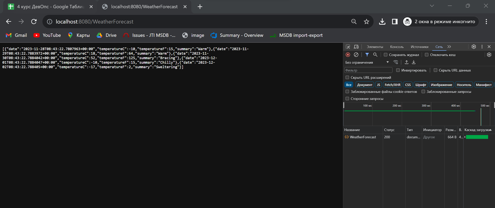
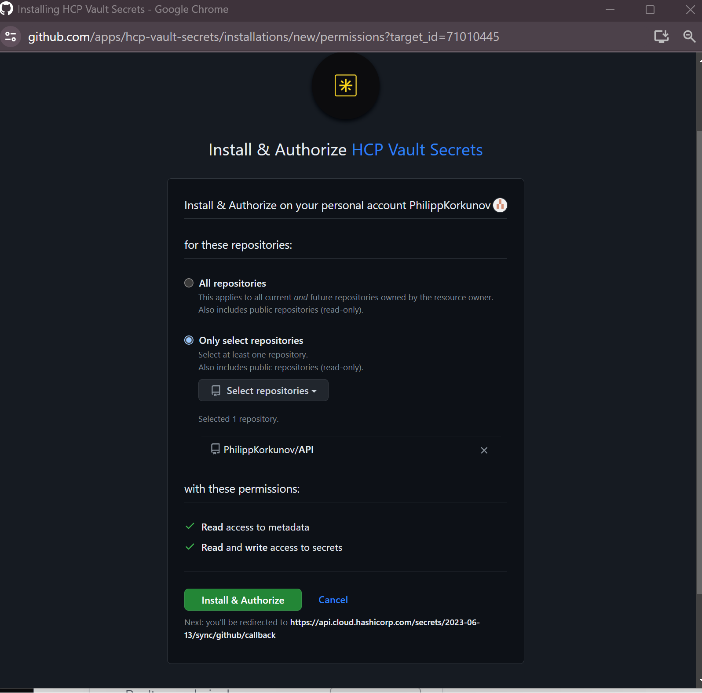

## Цель работы:
Создать плохой и хороший Dockerfile.

## Задачи:
* Написать плохой работающий Dockerfile и описать плохие практики, использующиеся в нем;
* Написать хороший Dockerfile, с исправленными плохими практиками;
* Описать плохие практики по использованию созданных контейнеров.

## Ход работы
### Dockerfile - плохой

Наш плохой Dockerfile запускается и работает корректно, однако в нем использованы плохие практики написания подобных файлов.

Разберем содержимое плохого Dockerfile (Dockerfile_d):


1. Строка №1.
  ```
  FROM ubuntu
  ```
  В данной строке мы указываем инструкцию "FROM", которая сообщает Docker о том, чтобы при сборке образа использовался бы базовый образ, который соответствует предоставленному имени и тегу. В нашем случае указано просто имя обюраза - ubuntu. Это плохая практика.
   * Начнем с того, что указывать имя без тега уже плохо. Ведь описанная сборка может жестко зависеть от версии образа ОС, что может в будущем повлечь за собой непредвиденные ошибки;
   * Основная функция нашего Dockerfile - это запуск Python-скрипта, который выводит информацию об окружении системы. Для этого нам нужен просто установленный интерпретатор Python и сама ОС. Для этого не обязательно брать большие по объему образы. Наоборот, меньшие образы более модульны и безопасны, а также с ними создание, отправка и извлечение изображений будет происходить быстрее.
2. Строка №5.
  ```
  ADD . .
  ```
  В данной строке мы указываем инструкцию "ADD", которая позволяет брать файлы и папки из контекста сборки и добавить их в текущую рабочую директорию образа. В нашем случае для данного пункта задействовано несколько плохих практик.
   * Существуют похожие инструкции "ADD" и "COPY". Вторая позволяет добавлять только локальные папки и файлы. Первая же дает возможность добавлять те же объекты, только с удаленных ресурсов, а также добавлять различные архивы. В нашем случае не задействуется дополнительный функционал инструкции "ADD" и мы можем выполнить те же действия при помощи "COPY", что будет более правильным решением;
   * Мы копируем из локальной директории все находящиеся в ней данные рекурсивно. Этого не стоит делать. Лучше указывать конкретные имена файлов, ведь такой подход, к примеру, помогает ограничить разрушение кеша;
   * Крайне важно сохранять файлы, которые часто изменяются ближе к концу Dockerfile, потому что в противном случае при каждом внесении изменения в копируемый файл, сборка будет делать дополнительные, возможно ненужные действия, которые будут влиять на ее эффективность.
3. Строки №7 и №8.
  ```
  RUN apt-get update
  RUN apt-get install -y python3
  ```
  В данных строках мы указываем инструкцию "RUN", которая позволяет создать слой во время сборки образа. Каждый слой увеличивает размер изображения, поскольку они кэшируются. Следовательно, с увеличением количества слоев увеличивается и размер. Лучше объединять команды в данной инструкции.
5. Строка №10.
  ```
  CMD python3 info_about_system.py
  ```
  В данной строке мы используем инструкцию "CMD", которая предоставляет Docker команду, выполняющуюся при запуске контейнера. Данной инструкции мы передаем команду в виде строки, это неправильно. В самой документации Docker говорится следующее: "Использование строковой формы приводит к тому, что Docker запускает ваш процесс с использованием bash, который неправильно обрабатывает сигналы". Помимо того, параметры инструкции "CMD" легко изменить, передав при запуске контейнера новые данные. Например, вот так:


Как видно, мы сломали нашу программу. В связи с этим рекомендуется использовать инструкцию "CMD" совместно с "ENTRYPOINT", переопределение которой возможно при указании специального ключа --entrypoint, что снизит риск случайных ошибок.

Далее покажем, что сборка плохого Docker-контейнера происходит корректно:


Видно, что сборка занимает относительно большое количество времени по части описанных ранее причин. Проверим запуск контейнера. При успешном запуске должны появить настройки окружения системы.



### Dockerfile - хороший

Определив все плохие практики, перепишем наш плохой Dockerfile (Dockerfile_b). Его обновленная версия выглядит следующим образом:


Хоть мы выше порробнее разбирали, что должно быть изменено, все же кратко опишем обновленные пункты в Dockerfile:
* Указано новое имя образа с точной версией (его размер намного меньше, нежели чем образ ubuntu, однако весь необходимый нам функционал присутствует)
  ```
  FROM python:3.9.6-alpine3.14
  ```
* Инструкции "RUN" объединены в одну, чтобы не плодить лишних слоев. При этом данный пункт был немного поменян в отличии от Dockerfile_b, так как текущий образ уже содержит Python интерпретатор. В замену были написаны команды по созданию пользователя и запуску команд от его имени. Это является хорошей практикой (чего не было указано в Dockerfile_b), так как появляется прослойка безопасности из-за изменении запуска процессов от имени назначенного пользовтаеля (default=root). Отсутствие данного пункта может привести к получению злоумышленником доступа к контейнеру со всеми root-привилегиями и возможность выполнить несколько атак на хост Docker.
  ```
  RUN addgroup --system app && adduser --system tuser app
  ```
* Заменена инструкция "ADD" на "COPY" и передан конкретный файл для копирования
  ```
  COPY info_about_system.py .
  ```
* Инструкция "CMD" разделена на части (выполнение с "ENTRYPOINT" и "CMD"), команды передаются в виде array
  ```
  ENTRYPOINT ["python3"]
  CMD ["info_about_system.py"]
  ```
Далее покажем, что сборка хорошего Docker-контейнера происходит корректно:


Далее запустим контейнер:



Как можно заметить, все по-прежнему запускается и корректно работает, однако время сборки уменьшилось в разы (практически в 10 раз быстрее =)). Победа!

### Плохие практики по использованию созданных контейнеров

1. Открытие лишних портов. Рекомендуется оставлять открытыми только порты, которые действительно нужны приложениям и избегать таких портов как SSH (22). В нашем же случае открытие портов не требуется вовсе.

2. Запуск контейнера без задаваимого имени (через --name). В таком случае Docker даст контейнеру произвольное название, что может запутать во время работы.

3. Запуск контейнера с привилегиями root, если это не обязательно, является плохой практикой. Лучше создавать и запускать контейнеры от имени не root-пользователей.
